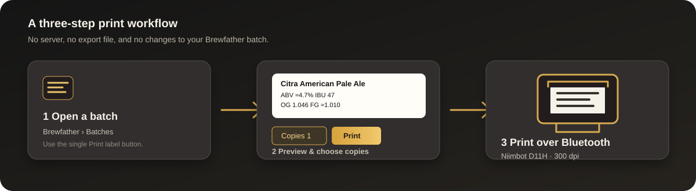
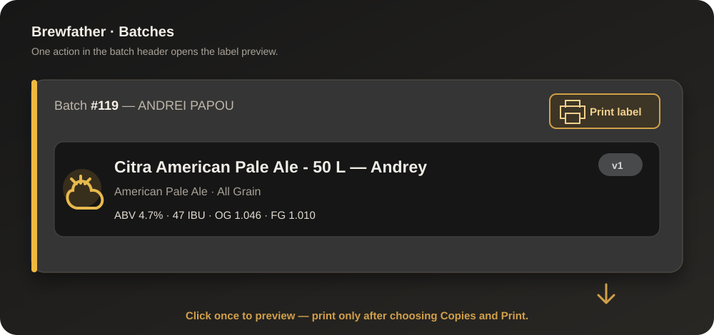
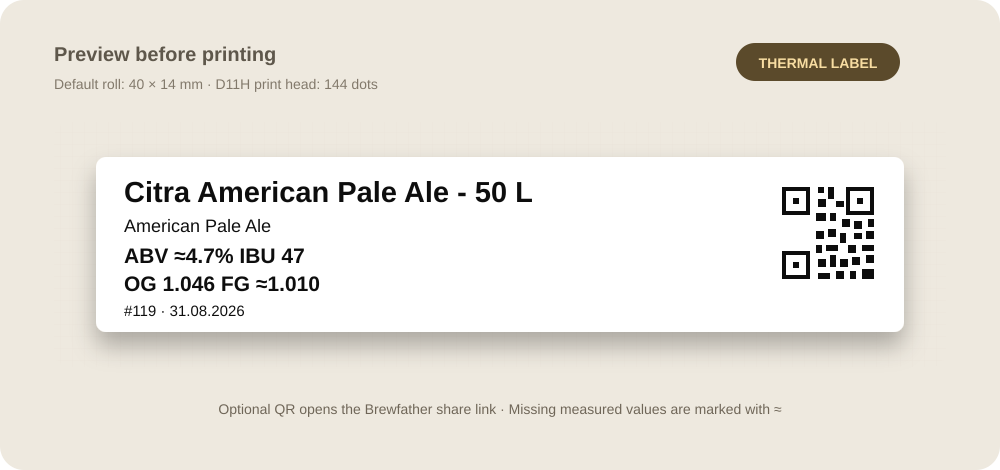

# Installation and first print

This guide walks through the public Chrome installation for **Brewfather →
Niimbot D11H**. It assumes that Chrome is already signed in to the Brewfather
account you use for brewing and that the D11H is nearby.



## 1. Get the extension

Choose one of these options:

- Download the [latest source ZIP](https://github.com/andreypopov/brewfather-niimbot/archive/refs/heads/main.zip)
  and unzip it.
- Download the smaller [credential-free package](https://github.com/andreypopov/brewfather-niimbot/raw/main/dist/brewfather-niimbot-0.3.0.zip)
  and unzip it.
- Clone the repository with:

  ```sh
  git clone https://github.com/andreypopov/brewfather-niimbot.git
  ```

In all cases, the folder you load must contain `manifest.json` directly:

```text
brewfather-niimbot/
├── manifest.json
├── content.js
├── label.js
├── options.html
└── ...
```

Do not select the outer download folder when it contains another folder with the
same name. Select the inner folder that contains `manifest.json`.

## 2. Load it in Chrome

1. Open `chrome://extensions`.
2. Enable **Developer mode** in the upper-right corner.
3. Click **Load unpacked**.
4. Select the extension folder from step 1.

Chrome will show a card named **Brewfather → Niimbot D11H**. The extension is
local to this Chrome profile; it is not installed from the Chrome Web Store.



## 3. Add Brewfather access

Open the extension card's **Details → Extension options** page. You can either:

- choose the `.env.local` file used by the brewery project, or
- enter `BREWFATHER_USER_ID` as **User ID** and `BREWFATHER_API_KEY` as **API key**.

The key needs **Read Batches** permission. The options page stores the values in
Chrome's local extension storage. They are not put into the public repository,
synced to other Chrome profiles, or sent to any service other than the official
Brewfather API.

Click **Save settings**, then reload the Brewfather tab. If the button does not
appear, click **Reload** on the extension card first and reload Brewfather again.

## 4. Choose the roll size

The default is **40 × 14 mm**. Open **Label settings** from the preview panel if
your installed roll is different:

- **Length, mm** controls the feed direction.
- **Tape width, mm** records the roll width. The D11H print head itself is 144
  dots wide, about 12.2 mm.
- **Print density** controls how dark the thermal image is.
- **Feed offset, mm** adds or removes a small amount of leading feed after you
  calibrate the roll.
- **Add QR code by default** starts each new preview with a QR code. In the
  preview panel, **Add QR** can be changed for the current job.

The settings page includes an enlarged sample label, so check the geometry before
using real tape.

## 5. Print the first label



1. Turn on the D11H and load the roll.
2. Close the NIIMBOT phone app if it is connected to the printer.
3. Open **Batches** in Brewfather.
4. Click the single **Print label** button in the batch header.
5. Confirm the label preview and enter the desired **Copies**. The default is `1`.
6. Optionally enable **Add QR**. The recipe must already have a public
   Brewfather share link; otherwise the preview explains how to resolve it.
7. Click the panel's **Print** button.
8. Select `D11_H` in Chrome's Bluetooth chooser and allow Bluetooth if macOS asks.

The first click only loads fresh batch data and draws the preview. The printer is
not contacted until the second **Print** click. The testable preview also shows
the values that will be sent to the printer:

```text
Citra American Pale Ale - 50 L
American Pale Ale
ABV ≈4.7%   IBU 47
OG 1.046   FG ≈1.010
#119 · 31.08.2026
```

## Updating the unpacked extension

When a new commit is available:

1. Download or pull the new files into the same local folder.
2. Open `chrome://extensions`.
3. Click **Reload** on the extension card.
4. Reload the Brewfather tab.

Chrome may ask you to choose the printer again after this reload. The Brewfather
access values remain in the extension's local storage.

## Quick troubleshooting

| Problem | What to check |
| --- | --- |
| The card has no button | The loaded folder must contain `manifest.json`; reload both the extension and Brewfather. |
| Access is missing | Save both User ID and API key; check that the key can read batches. |
| No D11H in the chooser | Turn on the printer, close the phone app, and keep the printer near the Mac or PC. |
| Preview text is clipped | Increase **Length, mm** in **Label settings** and preview again. |
| QR is unavailable | Share the recipe in Brewfather, preview again, or turn **Add QR** off for this label. |
| A second label does not start | Wait for the status message to finish; Web Locks prevents concurrent jobs from other tabs. |

For API behavior, rendering details, privacy, and development checks, see the
[main README](../README.md).
